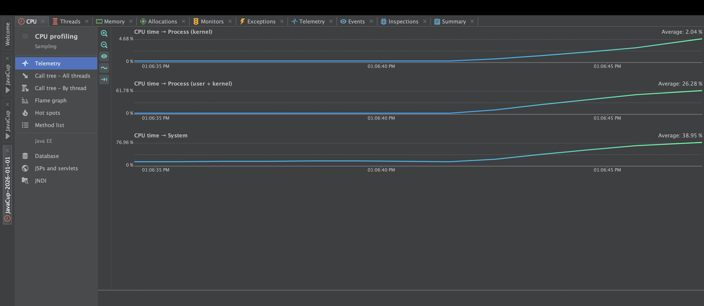
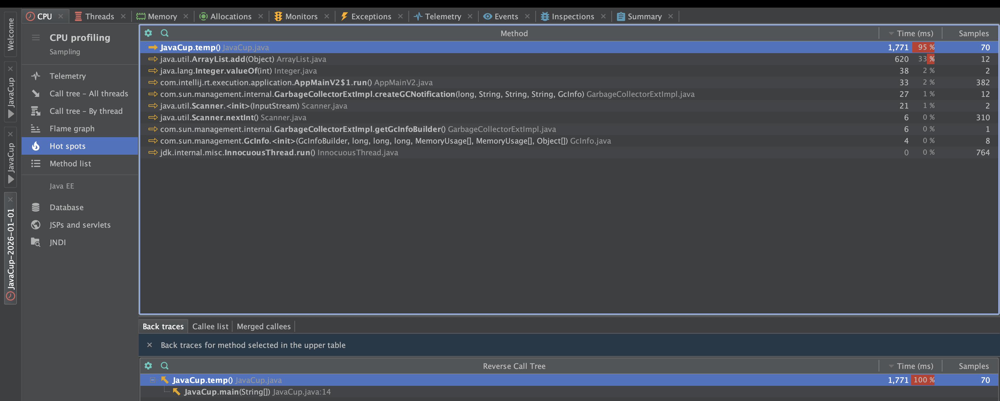
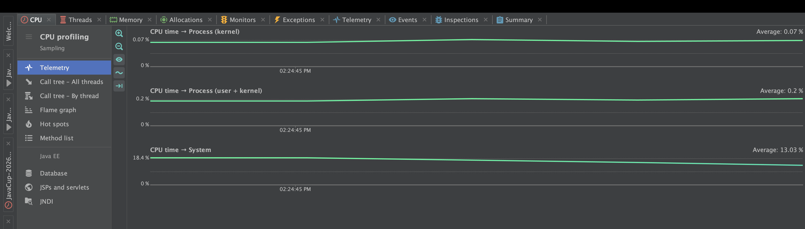

# گزارش تمرین پروفایلینگ و بهینه‌سازی 

## ۱. بخش اول

### مراحل کشف مشکل 
برای ریشه‌یابی دقیق خطا، مراحل زیر با استفاده از ابزار YourKit انجام شد:

1.  اجرا و بازسازی خطا: برنامه با استفاده از پلاگین YourKit در IntelliJ اجرا شد. پس از وارد کردن اعداد ورودی، برنامه وارد وضعیت پردازش سنگین (Freeze) شد.
2.  ضبط داده‌ها : در لحظه‌ی کندی برنامه، دکمه Start CPU Recording در پروفایلر فشرده شد تا رفتار برنامه در زمان واقعی ضبط شود. در نهایت capture performance snapshot برای ضبط اسنپ شات زده شد
3.  تحلیل نمودارها :
    *   با بررسی نمودار CPU Usage ، مشاهده شد که پردازنده درگیر محاسبات سنگین می شود.
    

    *   با مراجعه به تب Hot Spots ، متد temp() در صدر لیست قرار داشت که نشان می‌داد عمده منابع سیستم در این نقطه مصرف می‌شود.
    

### تحلیل علت 
اگر به فایل JavaCup.java نگاه کنید، متد temp اینگونه است:

public static void temp() {
    ArrayList a = new ArrayList();
    for (int i = 0; i < 10000; i++) // ۱۰ هزار بار
    {
        for (int j = 0; j < 20000; j++) { // ۲۰ هزار بار
            a.add(i + j);
        }
    }
}

این حلقه 
10,000×20,000=200,000,000
 بار اجرا می‌شوند
یعنی برنامه سعی می‌کند دویست میلیون عدد را در حافظه ذخیره کند. این کار هم CPU را درگیر می‌کند (برای محاسبه و add کردن) و هم رم (RAM) را پر می‌کند و باعث می‌شود Garbage Collector مدام فعال شود و برنامه عملاً قفل کند.

### راه حل 

از آنجا که لیست a یک متغیر محلی است و هیچ‌گاه از آن استفاده نمی‌شود (Dead Code)،می توان آن را حذف کرد و فقط حاصل جمع را محاسبه کرد(حتی این را هم می توان حذف کرد) البته کل تابع temp  بی فایده است (تاثیری در خروجی ندارد) و می توان کل بدنه آن را حذف کرد اما از انجایی که در دستور کار ذکر شده که از صرف نظر کردن آن و موارد مشابه جلوگیری شود، برداشت من این بوده که حتما بدنه باید باشد و حلقه اجرا شود.

کد اصلاح شده

public static void temp() {
        for (int i = 0; i < 10000; i++)
        {
            for (int j = 0; j < 20000; j++) {
                int calculation = i + j;             }
        }
    }

نتایج cpu و hotspot  بعد اعمال تغییرات به این شکل است

